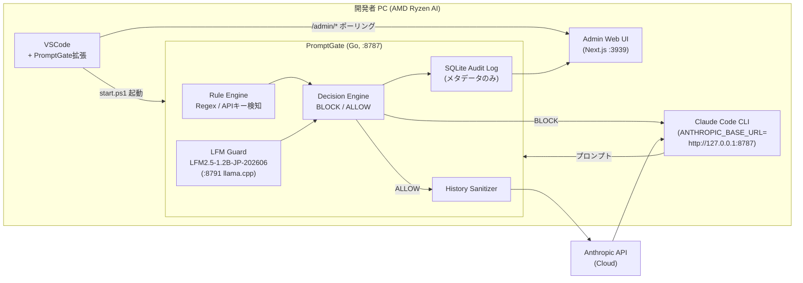

# FoxCo: Local LFM Prompt Firewall

Liquid AI Hackathon "Hack the Liquid WAY" 向けの検討メモ兼プロジェクトREADMEです。

本プロジェクトは、ChatGPT / Claude / Gemini / 社内LLMなどへ送信される前のプロンプトを、ローカルまたは社内プロキシ上でLFMが検査し、センシティブ情報・個人情報・社外秘情報の送信を未然に防ぐことを目的とします。

## 1. Executive Summary

企業で生成AI利用が進むほど、「ユーザーがLLMへ何を送っているか」を守る必要があります。既存のLLMゲートウェイやDLP製品は、送信後・サーバ側で検知する構成が多く、情報を一度外部または中央サーバへ渡す必要がある、監視用LLM/APIのコストが増える、日本語の社内文脈に弱い、という課題があります。

FoxCoはこの検査を送信前に行います。LFM2.5-1.2B-JP-202606をローカルPCまたは社内プロキシで動かし、ユーザーがLLMに投げようとしている内容を先回りして判定します。判定結果に応じて、ブロック、マスキング、またはLFMによる代理応答を行います。

狙う価値は次の3つです。

- 漏洩防止: クラウドLLMへ送る前に危険な内容を止める
- コスト削減: 監視用途を小型LFMでローカル処理し、クラウドAPI呼び出しを減らす
- 日本語・社内文脈対応: 固有名詞、案件名、取引先名、部署特有の表現をFT/辞書/ルールで継続的に反映する

## 2. Hackathon Context

公式イベントは Liquid AI x WAY Equity Partners x AMD による2日間の東京オフラインハッカソンです。Liquid Foundation Models (LFMs) を使い、日本市場向けのインパクトあるアプリケーションを作ることがテーマです。

確認済み情報:

- イベント: Hack the Liquid WAY
- 日程: 2026-06-06 09:00 JST から 2026-06-07 18:00 JST
- 場所: 東京 / オフラインのみ
- チームサイズ: 1から3人
- 主なモデル: LFM2.5, LFM2.5-VL, LFM2.5-Audio-JP, LFM2.5-1.2B-JP-202606 など
- 各チームにAMD Ryzen AI PCが割り当てられ、Day 2の審査でオンデバイス実演を行う

このプロジェクトは Track 1: LFM Application Track を第一候補にします。理由は、エンドユーザー向けアプリケーション/ワークフローであり、LFMがオンデバイスでプライバシー・低遅延・低コストを実現するコア機能になるためです。

## 3. Submission Requirements

Submission Guide上、チームは提出時にTrack 1またはTrack 2を1つ選びます。TrackごとにGold/Silverを競い、全チーム共通の提出物に加えてTrack別要件を満たします。

共通提出物:

- Slide deck: 2から4枚。日本の課題/ユースケース、なぜLFMか、アプローチ、結果を含める
- Live demo: Day 2のデモセッションで5分
- Tagline: 1から2行
- Public repo link: 登録時のopen-source project agreementに従う
- Demo assets folder: 暗号化し、Discordで `@liquid-yan` にパスワード共有
- Demo assets folder名: `TEAMNAME_TrackN_HackTheLiquidWAY_DemoAssets`
- Assets内容: 60から90秒のデモ動画、高解像度スクリーンショット、プロダクト/チーム写真、キャプション/プロフィール、ファイル説明とセットアップ手順を含む `README.txt`

Track 1で強調される点:

- プロダクトとしての有用性
- 非技術ユーザー向けのエンドユーザー体験
- 従来ワークフローと比較したワークフロー設計
- LFMがオンデバイスでコアアプリケーションをどれだけ効果的に支えているか
- 技術サマリー: 使用モデル/フレームワーク、計算環境、デバイス、レイテンシ/効率、アーキテクチャ図または主要技術革新

## 4. Judging Criteria

Judging Criteriaは審査員評価とオーディエンス投票の両方です。

- Fit to Challenge: なぜLFMなのか。frontier cloud LLMだけを使うよりどれだけ良いのか。日本産業に実在する課題とインパクトがあるか
- Creativity & Design: 実装の独自性、発想、設計の練り込み
- Quality & Completeness: ソフトウェアとプレゼン全体の完成度、最初の顧客に届くピッチになっているか
- Resource Efficiency: 低コスト、低レイテンシ、低消費電力。エッジ/低コストデバイス展開は加点
- Track-Specific Judging: Track 1ではプロダクト有用性、UX、ワークフロー設計、オンデバイスLFMの必然性

この案で審査に刺すべきメッセージ:

- なぜLFMか: 「クラウドへ送る前」の判定には、ローカルで動く小型・高速・日本語対応モデルが必要
- 何が良いか: 送信後監査ではなく、送信前のリアルタイム予防
- 日本の産業インパクト: 生成AI利用を止めずに、個人情報保護・営業秘密保護・社内セキュリティを実現する
- Resource Efficiency: 社員PC/社内プロキシで常時動かせるため、クラウド監視LLMの追加APIコストを削減できる

## 5. Product Concept

仮称: FoxCo Local LFM Prompt Firewall

ユーザーはChatGPTやClaudeを通常通り使います。FoxCoはローカルPCまたは社内ネットワークのプロキシとして動き、LFMの存在をユーザーに意識させません。

基本フロー:

1. ユーザーがLLMへプロンプトを送信しようとする
2. プロキシまたはローカルクライアントが送信前に本文を捕捉する
3. ルールベース検知とLFM判定を組み合わせて、危険度と検出エンティティを返す
4. ポリシーに応じて処理を分岐する
5. 安全な場合のみクラウドLLMへ転送する

処理モード:

- Block: 送信を止め、理由と修正案を返す
- Mask: 検出箇所を伏せ字またはプレースホルダへ置換し、マスキング済みプロンプトを送る
- Local Answer: クラウドへ送る必要がない内容はLFMが代理応答する

検知対象:

- 個人情報: 氏名、住所、電話番号、メールアドレス、社員番号、顧客番号
- 機密情報: 未公開プロジェクト名、社内コード名、取引先名、契約条件、売上/原価情報
- 認証情報: APIキー、アクセストークン、パスワード、秘密鍵、接続文字列
- コード/資料: 社外秘ソースコード、設計書、議事録、提案書ドラフト
- 文脈リスク: 「取引先名 + 未公開技術名」「個人名 + 病歴」など、単語単体ではなく組み合わせで危険になるもの

## 6. Why LFM

LFM2.5-1.2B-JPは、日本語特化の1.2Bパラメータモデルで、32K tokensの文脈長を持ち、日本語生成・翻訳・会話に向けて調整されています。Liquid AIの公開情報では、LFM2.5-1.2B-JPは日本語知識と指示追従で同規模モデルに対する優位性が示されています。

LFMを使う必然性:

- 送信前検査では、クラウドへ出さずに判断できることが本質的価値
- 小型モデルなので社員PCやAMD Ryzen AI PCで常時動かしやすい
- 日本語の曖昧な社内文脈を扱うには、日本語特化モデルが向いている
- 企業ごとの固有名詞や秘密ルールをFT/LoRA/辞書で継続更新しやすい
- 低遅延にできれば、ユーザー体験を壊さずにリアルタイム警告できる

過去モデルとして `LiquidAI/LFM2-350M-PII-Extract-JP-GGUF` があります。これは日本語テキストからPIIをJSON抽出し、契約書、メール、医療レポート、保険請求などのマスクに使うオンデバイス用途のモデルです。ただし、今回の案では単純なPII抽出だけではなく、社内文脈、機密性、送信先、過去会話、対応方針まで含めて判定する必要があります。

## 7. Architecture Draft



実装済みコンポーネント:

| コンポーネント | 実装 | 場所 |
|---|---|---|
| Go プロキシ | Anthropic Messages API互換、BLOCK/ALLOW、fail-closed | `proxy-server/cmd/proxy` |
| Rule Engine | APIキー・認証情報・機密マーカーの正規表現ガードレール | `proxy-server/internal/dlp` |
| LFM Guard | llama.cpp HTTPクライアント (swappable PromptProfile) | `proxy-server/internal/inference` |
| History Sanitizer | ブロック済み履歴の構造的除去 + Messages配列検証 | `proxy-server/internal/sanitizer` |
| SQLite Audit Log | メタデータ記録（raw textはデフォルト無効） | `proxy-server/internal/storage` |
| Admin Web UI | Next.js、検知ログ・統計・ブロック理由ビュー | `proxy-server/web` |
| VSCode Extension | プロキシ管理・サイドバーログ・Guard有効ターミナル | `vscode-extension/` |
| Claude Code Hook | プロキシ未起動・未設定時の警告 | `.claude/settings.json` |

## 8. Team Roles

3人チーム想定:

- Fine-tuning Lead: LFM2.5-1.2B-JP-202606のFT/LoRA、学習データ設計、評価
- Proxy/App Lead: ローカルプロキシ、OpenAI互換API、Web管理画面、デモUI
- Senior Manager / Generalist: 要件整理、審査軸へのストーリー作り、評価設計、デモ台本、README/資料、タスク拾い

Senior Managerが拾うべき仕事:

- 5分デモの体験設計とストーリー化
- 審査基準に対する訴求ポイントの整理
- 検知カテゴリとデモ用サンプルデータの作成
- 競合/既存手法との差分説明
- レイテンシ/コスト削減の測定項目定義
- スライド2から4枚の構成
- Demo assets folderとREADME.txtの準備

## 9. MVP Scope

### クイックスタート

```powershell
# 1. llama.cpp (Vulkan build) を入手
winget install ggml.llamacpp

# 2. プロキシを起動 (sidecar + proxy + admin UI)
cd proxy-server
.\start.ps1                      # AMD iGPU (Vulkan) + LFM2.5-1.2B
.\start.ps1 -Classifier keyword  # モデルなし、確定的ルール判定 (デモ確認用)

# 3. Claude Code をプロキシ経由で起動
#    VSCode 拡張の「Guard 有効ターミナルを開く」コマンド、または:
$env:ANTHROPIC_BASE_URL = "http://127.0.0.1:8787"
claude
```

Admin UI: `http://127.0.0.1:3939`

### 実装済み機能

1. Anthropic Messages API互換のローカルプロキシ (`/v1/messages`, `/v1/messages/count_tokens`)
2. LFMによるプロンプト分類 (BLOCK / ALLOW) — llama.cpp OpenAI互換APIで呼び出し
3. ルールガードレール — APIキー・秘密鍵・認証情報の即時ブロック
4. ブロック済み履歴のサニタイズ — 汚染された会話ターンを除去してから転送
5. SQLite監査ログ + `/admin/*` 読み取りAPI
6. Admin Web UI (Next.js) — 検知ログ・ブロック統計・ブロック理由Top N
7. VSCode拡張 — プロキシ起動・サイドバーログ・Guard有効ターミナル
8. Claude Code hook — プロキシ未起動時の警告

### デモシナリオ

- ユーザーが「APIキー + 未公開プロジェクト名」を含むプロンプトを入力
- PromptGateが送信前に検知し、Claude Codeにブロックレスポンスを返す
- Admin UI / VSCodeサイドバーでブロック理由・レイテンシをリアルタイム表示
- `start.ps1 -Classifier keyword` で LFM なしのルールのみ動作も実演可能

## 10. Evaluation Plan

測るべき指標:

- Precision: 検知したものが本当に危険だった割合
- Recall: 危険なものをどれだけ漏らさず検知できたか
- False Positive Rate: 安全なプロンプトを止めすぎていないか
- Latency: 1リクエストあたりの判定時間
- Cost Avoidance: ブロック/代理応答によりクラウドLLMへ送らなかったtoken/API費
- Masking Quality: マスク後でもタスク目的が維持されるか

比較対象:

- 正規表現のみ
- 既存PII抽出モデルのみ
- LFM Guardのみ
- 正規表現 + LFM Guard

デモで出したい数値:

- 例: ローカル判定 p50/p95 レイテンシ
- 例: サンプル50件で危険プロンプトの検知率
- 例: クラウド送信token削減率

## 11. Open Questions

- ~~LFM2.5-1.2B-JP-202606の実行ランタイムは何を使うか~~ → **解決済み**: OpenAI 互換サイドカー方式。最終環境は AMD Ryzen AI APU（RDNA3.5 iGPU + XDNA2 NPU。例: 開発機 Ryzen AI MAX+ 395 / デプロイ先 Ryzen AI 5 340）。既定 `start.ps1 -Backend auto` で **NPU → Vulkan(iGPU) → CPU**。NPU は自作 Ryzen AI ONNX シム（`proxy-server/npu/npu_server.py`、LFM2 token-fusion ONNX）、Vulkan は llama.cpp Vulkan ビルド（`-ngl 99`）。NVIDIA/CUDA 不要。JP fine-tune の NPU 化は AMD の token-fusion 変換が要るため別途課題（`proxy-server/docs/todo.md`）。詳細は `proxy-server/docs/spec-proxy.md`
- ~~プロキシ方式はOpenAI互換APIに絞るか~~ → **解決済み**: `ANTHROPIC_BASE_URL` による Claude Code ターゲットのプロキシ方式を採用。OpenAI互換ではなく Anthropic Messages API互換。
- ChatGPT/Claude公式UI (ブラウザ) を対象にする場合、HTTPS中間プロキシ方式が必要。MVPスコープ外。
- ~~Responses APIの履歴引き継ぎにどう対応するか~~ → **解決済み**: History Sanitizerがブロック済みターンを構造的に除去してから転送。
- FTの対象はPII抽出、機密分類、ポリシー判定のどれを優先するか (training/ で継続検討)
- デモ用の社内辞書・疑似機密データをどう作るか (training/data/ 参照)

## 12. Source Links

- Liquid AI Hackathon: https://hackathons.liquid.ai/
- Luma event page: https://luma.com/7fjlam5k?tk=uEBug7
- Internal Event Guide: https://liquidai.notion.site/Hack-the-Liquid-WAY-Event-Guide-370cbef042ad8120b019f78c480e41d8
- Idea memo: https://docs.google.com/document/d/1OHIdenqPsl8lUNCfcc3I7SIT2F4gFC6BL11odBSDe0w/edit?usp=sharing
- LFM2.5-1.2B-JP docs: https://docs.liquid.ai/lfm/models/lfm25-1.2b-jp
- LFM2.5 blog: https://www.liquid.ai/blog/introducing-lfm2-5-the-next-generation-of-on-device-ai
- LFM2-350M-PII-Extract-JP-GGUF: https://huggingface.co/LiquidAI/LFM2-350M-PII-Extract-JP-GGUF

Last updated: 2026-06-06 JST (proxy-server Go実装・VSCode拡張追加)
